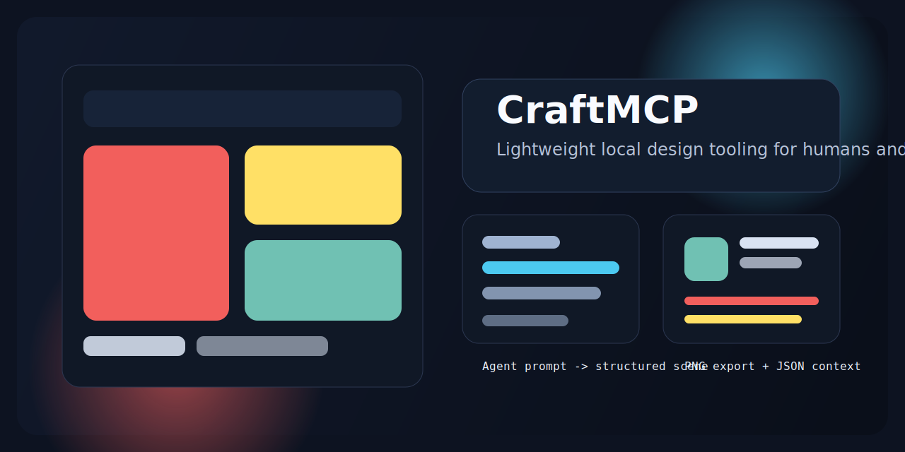

# CraftMCP

CraftMCP is a lightweight open-source Windows design tool built for human and AI collaboration.

It gives AI agents a local workspace for creating and editing visual designs, while keeping the result fully editable by humans. The goal is not to replace professional design suites. The goal is to provide a practical open-source tool people can use with their own AI models to make social graphics, UI mockups, and slide-style layouts.

## Why CraftMCP

Current design tools are mostly built for direct human use, cloud collaboration, or professional feature depth. They are not designed around:

- structured agent actions,
- deterministic local state,
- machine-readable design context,
- and easy human refinement after AI generation.

CraftMCP is meant to fill that gap with a focused product surface.

## Core Idea

CraftMCP should let an AI model:

- create a canvas,
- place text, shapes, and images,
- organize layers,
- update an existing design,
- and export both a rendered image and the full structured scene.

At the same time, a human user should be able to open the same design, inspect it visually, and make direct edits without fighting the system.

## MVP Goals

- Build a Windows-first local desktop app
- Support human editing of AI-generated designs
- Use a structured command layer for agent operations
- Export PNG for output
- Export JSON for perfect machine-readable design context
- Stay intentionally lightweight and open-source-friendly

## Primary Use Cases

- Create social media graphics from prompts
- Generate UI mockups for apps
- Make slide-style layouts and presentation visuals
- Re-open an existing design and revise text, colors, spacing, or images
- Hand the exported JSON back to another agent for iterative improvement

## Product Principles

- Local-first
- Agent-first, human-editable
- Deterministic scene state
- Reversible operations
- Open-source and inspectable
- Lightweight over bloated

## Planned MVP Surface

- Canvas with preset sizes
- Layer panel
- Property panel
- Prompt input for agent instructions
- Basic design primitives:
  - text
  - rectangles
  - circles
  - lines
  - images
- Move, resize, rotate, reorder, group, and style elements
- Save editable local project files
- Export PNG
- Export deterministic JSON scene data

## JSON Export Matters

CraftMCP treats JSON export as a core feature, not a side feature.

That export should preserve:

- canvas size and background,
- layer ordering,
- element types,
- positions and dimensions,
- text content and style,
- image references,
- grouping and hierarchy.

This is what allows agents to work from exact design context instead of screenshots or guesswork.

## What CraftMCP Is Not

CraftMCP is not aiming for:

- Figma parity
- full professional vector tooling
- multiplayer collaboration
- cloud-first workflows
- animation and motion design
- a giant plugin ecosystem in v1

## Status

The project is currently in product-definition stage. The MVP scope, use cases, JSON export contract, and product framing have been defined. Architecture and implementation planning are the next steps.

## Contributing

This project is currently being shaped around a focused MVP. If you want to contribute, the most valuable areas will likely be:

- desktop app architecture,
- scene graph design,
- command schema for agent operations,
- deterministic JSON serialization,
- and practical Windows-first UX.

## Vision

CraftMCP should become the open-source design workspace people reach for when they want to work with their own AI models locally, generate a first-pass design quickly, and still retain direct human control over the final result.
